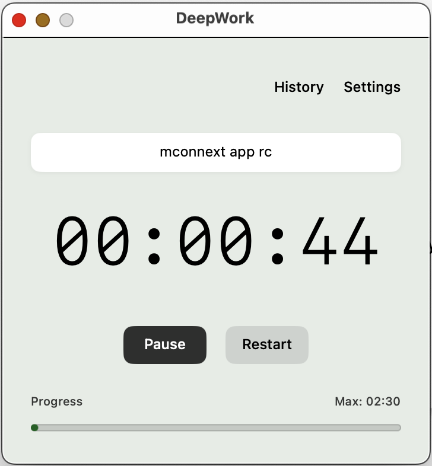

I could not find a good fit timer, so I wrote a new one. 
Almost the repo was generated by AI.

# DeepWork

A minimalist macOS timer application built with SwiftUI for focused work sessions.



## Features

- Timer with start/pause/resume/restart controls
- Session history tracking with statistics
- Audio feedback with volume control
- Customizable themes and session duration
- Progress visualization
- Fixed 360x360 window size

## Architecture

**Tech Stack**: SwiftUI, AVFoundation, Combine, UserDefaults

**Pattern**: MVVM with ObservableObject

**Components**:
- `TimerViewModel`: Timer logic and state management
- `HistoryViewModel`: Session history management  
- `AudioService`: Audio playback service
- `SessionModel`: Data models for sessions and settings

## Project Structure

```
DeepWork/
├── DeepWorkApp.swift          # App entry point
├── ContentView.swift          # Main timer UI
├── TimerViewModel.swift       # Timer business logic
├── HistoryView.swift          # Session history UI
├── HistoryViewModel.swift     # History business logic
├── SettingsView.swift         # Settings configuration UI
├── SessionModel.swift         # Data models
├── AudioService.swift         # Audio playback service
└── slow-cinematic-clock-ticking.mp3  # Audio asset
```

## Build Instructions

1. Open `DeepWork.xcodeproj` in Xcode
2. Build and run on macOS target

## Requirements

- Xcode with SwiftUI support
- macOS development target
- Audio file included in bundle 
